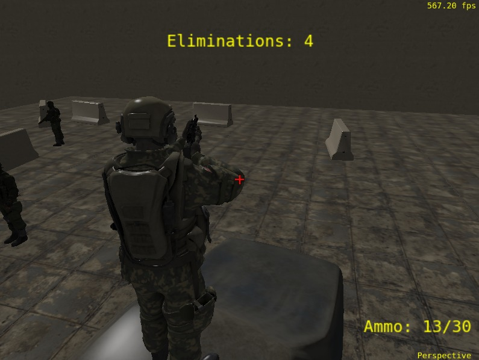
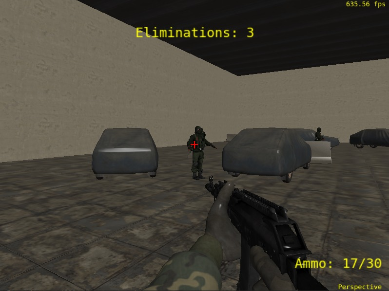

# TrabalhoFinal-FCG
Aplicação gráfica para trabalho final da disciplina de Fundamentos de Computação Gráfica

# Link do vídeo de demonstração do jogo:
    https://www.youtube.com/watch?v=4T5y8_IVXV8

# Contribuições de cada membro da dupla para o trabalho:
Augusto Kessler Pires:
    Encontrou todos os objetos e texturas, fez a pose do modelo principal no blender e importou todos os objetos e texturas na main, também fez toda a lógica de posição aleatória dos objetos e configurações, fez as alterações no shader_vertex e shader_fragment, exceto pelo projétil. Fez as hitboxes das barricadas e carro e função e botão de visualizar as mesmas, A lógica de eliminacões e munição e recarregar, a particula de sangue e também do muzzle flash.

Bruno Fialho Zawacki:
    Fez a hitbox do personagem principal e todas as lógicas dos tipos de colisões do jogo, criou o arquivo collision.cpp e collision.h, shader fragment do projétil, estrutura e lógica do projétil, as funções de físicas de gravidade do player, ajustou a render distance e nome da janela, fez lógica de morte do jogador, corrigiu bugs em geral (por exemplo: bug da partúcula de sangue e double damage), organizou e comentou grande parte do código.

# Utilização de Ferramentas de IA:

Utilizamos IA para desenvolver nosso projeto, usando ferramentas como Copilot e Gemini, foi usado para ajudar na criação de novas features e fornecer uma base, e também para perguntas conceituais e debugging. As seguintes partes foram feitas usando IA: algumas funções de checar colisão com bounding boxes; Renderização de particulas e hitboxes; O cálculo da equação de Bezier; A adaptação de Phong para Gouraud no vertex. Como o projeto era muito grande a IA acabou não sendo tão eficaz para fazer código funcional, pois ficava criando variáveis que já existiam e usava funções do glm que foram proibidas pelo professor. Porém, ainda foi muito útil para ajudar a organizar o código e ajudar a estruturar várias funções úteis para nossa aplicação. Concluímos que foi mais fácil receber um código errado da IA e corrigi-lo do que simplesmente não utilizar essas ferramentas e faze-lo sozinho.

# Processo de Desenvolvimento e do uso em sua aplicação dos conceitos de Computação Gráfica:

Utilizamos como base para o nosso projeto o código do laboratório 5 desenvolvido em aula, Primeiramente foi modificado a textura do plano do chão, que já estava implementado no laboratório 5, e então importamos o objeto do inimigo, que era composto por vários objetos com diferentes texturas. Inicialmente, tentamos fazer de modo automático o processo de importar as texturas dos mtl. Porém, acabou não dando certo, e então a câmera em terceira pessoa foi a primeira implementada e árvores com posições aleatorias (depois substituídas pelas barricadas) foram geradas, porém as árvores eram muito complexas, tivemos vários problemas para adicionar a textura nas suas folhas e estavam também diminuindo muito o fps, então decidimos mudar para um ambiente interno e usar outros objetos. Adicionamos as funções de movimentação do personagem e física para o pulo. Depois, implementamos a lógica para os projéteis e a câmera em primeira pessoa, adicionamos as paredes e teto e as novas texturas e consertamos a 3 pessoa. Além disso, adicionamos a opção do zoom que muda o sistema da câmera de terceira para primeira pessoa ao se aproximar do personagem. Criamos um sistema de munição e adicionamos um novo objeto, as barricadas de concreto, fizemos a colisão das paredes com o personagem principal. A movimentação de bezier aleatória dos inimigos foi adicionada, o gouraud shade e o sistema de vida e dano dos inimigos foi feita, recoil ao atirar foi adicionado, cor do texto da hud mudado para amarelo e as particulas de muzzle flash e sangue adicionada, colisao do tiro com as barricadas foi melhorada e adicionado o score de eliminações, colisao do personagem com as barricadas foi feita e melhorada, foi adicionado um objeto de um carro encontrado no site PolyHaven, feita a colisão do carro com o personagem e a colisao do personagem com os inimigos. Por fim, adicionamos o efeito de morte ao enconstar nos inimigos, o modo para desenhar as boundingboxes de todos os objetos e correção e limpeza do código final.

  

# Manual da aplicação:

    WASD - Movimentação direcional do personagem
    Espaço - Personagem Salta
    Movimentação do Mouse - Movimenta a câmera
    Botão Esquerdo do Mouse - Atira
    Scroll do Mouse - Muda o zoom, se próximo o suficiente troca para primeira pessoa
    R - Recarrega a munição
    Z - Ativa HitBoxes dos elementos
    F - Recarrega Shaders
    ESC - Fecha a aplicação

# Compilação e execução:

    Ter compilador de C++
    Ter Cmake instalado
    Instalar o VSCode
    Instalar extensões de C++ e Cmake tools no vscode
    Selecionar o Compilador para o Cmake
    Clicar no botão de play pequeno na parte inferior

