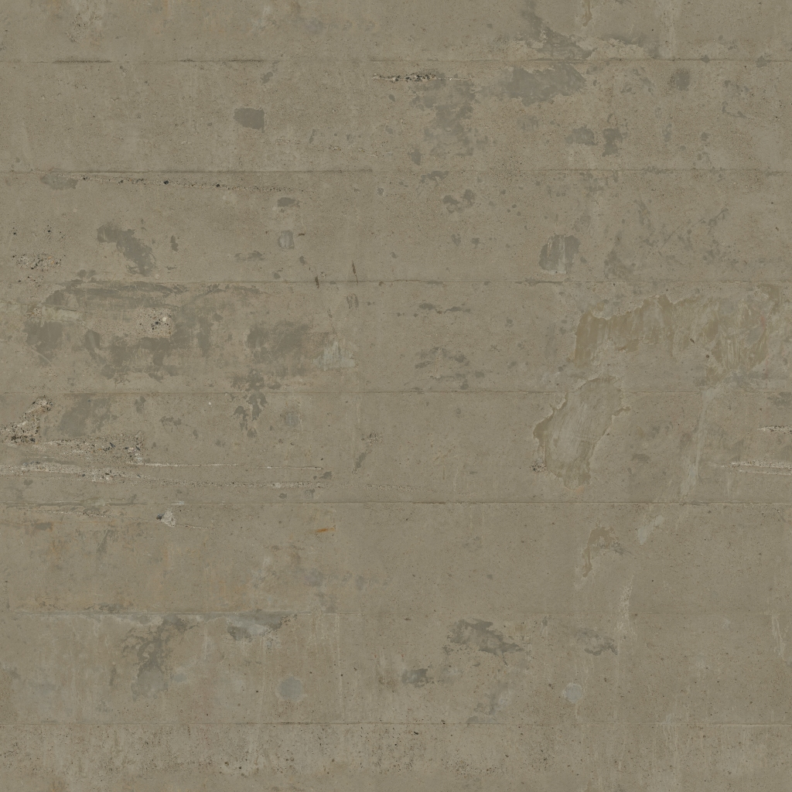

# TrabalhoFinal-FCG
Aplicação gráfica para trabalho final da disciplina de Fundamentos de Computação Gráfica
Parágrafo listando as contribuição de cada membro da dupla para o trabalho;
Contribuições de cada membro da dupla para o trabalho:
Augusto Kessler Pires:
    Encontrou todos os objetos e texturas, fez a pose do modelo principal no blender e importou todos os objetos e texturas na main, também fez toda a lógica de posição aleatória dos objetos e configurações, fez as alterações no shader_vertex e shader_fragment, exceto pelo projétil. Fez as hitboxes das barricadas e carro e função e botão de visualizar as mesmas, A lógica de eliminacões e munição e recarregar, a particula de sangue e também do muzzle flash.

Bruno Fialho Zawacki:
    Fez as hitbox do personagem principal e todas as lógicas de colisões, o objeto e shader fragment do projétil e sua estrutura, as funções físicas de gravidade, ajustou a render distance e nome da janela, lógica de morte do jogador, correção da particula de sangue.

Parágrafo curto indicando se a dupla fez uso do ChatGPT (ou alguma outra ferramenta similar, como Claude, Gemini, LLaMa, Github Copilot, OpenAI Codex, etc.) para desenvolvimento do trabalho, descrevendo como a ferramenta foi utilizada e para quais partes do trabalho. O parágrafo deve também incluir uma análise crítica descrevendo quão útil a dupla achou a ferramenta, onde ela auxiliou e onde ela não auxiliou adequadamente;

Utilizamos IA para desenvolver nosso projeto, usado ferramentas como Copilot e Gemini, foi usado para ajudar na criação de novas features e fornecer uma base, e também para perguntas conceituais e debugging. As seguintes partes foram feitas usando IA: algumas funções de checar colisão com bounding boxes; Renderização de particulas e hitboxes; O cálculo da equação de Bezier; A adaptação de Phong para Gouraud no vertex. Como o projeto era muito grande a IA acabou não sendo tão eficaz para fazer código funcional, pois ficava criando variáveis que já existiam e usava funções do glm que foram proibidas pelo professor.

Descrição do processo de desenvolvimento e do uso em sua aplicação dos conceitos de Computação Gráfica estudados e listados nos requisitos acima;
Utilizamos como base para o nosso projeto o código do laboratório 5 desenvolvido em aula, Primeiramente foi modificado a textura do plano do chão, que já estava implementado no laboratório 5, e então importamos o objeto do inimigo, que era composto por vários objetos com diferentes texturas, inicialmente tentamos fazer de modo automático importar as texturas dos mtl porém acabou não dando certo, e então a câmera em terceira pessoa foi a primeira implementada e árvores com posições aleatorias foram geradas, porém as árvores eram muito complexas e estavam diminuindo muito o fps, então decidimos mudar para um ambiente interno e usar outros objetos, adicionamos as funcoes de pulo, depois  projéteis e a primeira pessoa, adicionamos as paredes e teto e as novas texturas e consertamos a 3 pessoa, sistema de munição e após isso as barricadas de concreto, colisao das paredes e personagem principal e a visao em 1 pessoa. A movimentação de bezier aleatória dos inimigos foi adicionada, o gouraud shade e o sistema de vida e dano dos inimigos foi feita, recoil foi adicionado, cor do texto da hud mudado para amarelo e as particulas de muzzle flash e sangue adicionada, colisao do tiro com as barricadas foi melhorada e adicionado o score de eliminações, colisao do personagem com as barricadas foi feita e melhorada, foi adicionado carros e a colisao com inimigos, o efeito de morte ao enconstar nos inimigos e correção e limpeza do código final.

No mínimo duas imagens mostrando o funcionamento da aplicação;
  modificar

Um manual descrevendo a utilização da aplicação (atalhos de teclado, etc.);
Manual da aplicação:
    WASD - Movimentação direcional do personagem
    Espaço - Personagem Salta
    Movimentação do Mouse - Movimenta a câmera
    Botão Esquerdo do Mouse - Atira
    Scroll do Mouse - Muda o zoom, se próximo o suficiente troca para primeira pessoa
    R - Recarrega a munição
    Z - Ativa HitBoxes dos elementos
    F - Recarrega Shaders
    ESC - Fecha a aplicação

Explicação de todos os passos necessários para compilação e execução da aplicação;
Ter compilador de C++
Ter Cmake instalado
Instalar o VSCode
Instalar extensões de C++ e Cmake tools no vscode
Selecionar o Compilador para o Cmake
Clicar no botão de play pequeno na parte inferior